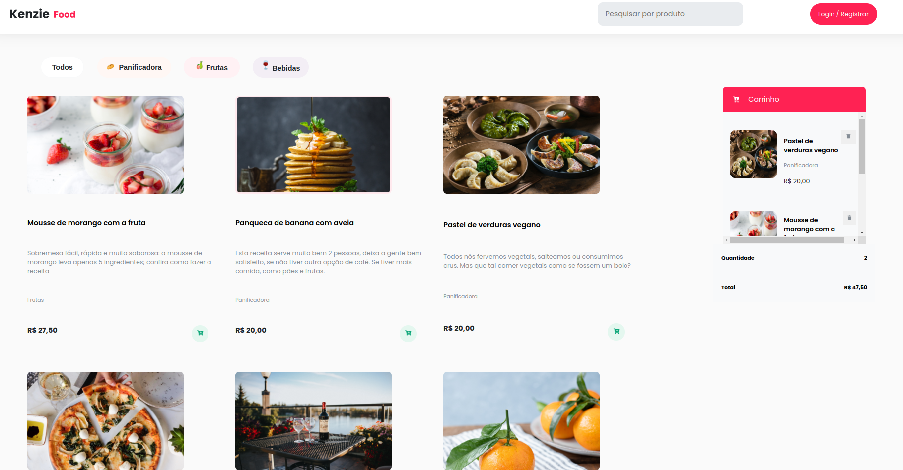

## Kenzie Food

O Kenzie Food foi o primeiro projeto em equipe desenvolvido do zero com o uso de html, css e javascript. Tinhamos acesso a um figma mobile e um desktop. O projeto consiste em telas de cadastro, login , dashboard e admin. Em todas as páginas fazemos o consumo de uma API que possui as rotas de post, patch, get e delete. Apenas administradores pré selecionados pela equipe de ensino Kenzie com um email cadastro pode adicionar novos produtos e o get é realizado conforme os produtos adicionados. Ja o usuario que não está logado, tem acesso a todos os produtos da api. Esse projeto também possui a gravação dos dados do carrinho no localStorage, caso o usuario feche a pagina os produtos ainda estarão adicionados

## Rotas

### Get `/product`
